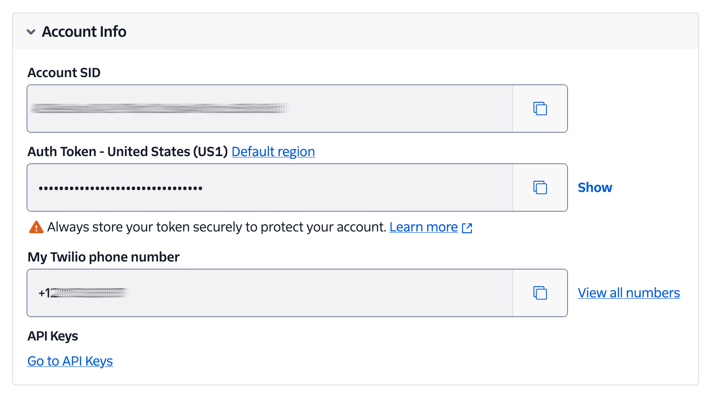

<!-- markdownlint-disable MD013 -->
# Mezzio Twilio Webhook Validator

This package provides [PSR-15-compliant middleware][psr-15] for validating Twilio webhooks in [Mezzio][mezzio] applications.

## Requirements

To use the application, you'll need the following:

* A Twilio account (free or paid). [Create an account][try-twilio] if you don't already have one.
* PHP 8.4
* [Composer][composer] installed globally

## Usage

The package is designed to be used as part of Mezzio-based applications, and goes to a lot of effort to make doing so as simple as possible.

### Install the package

To install the package, use Composer by running the following command:

```bash
composer require settermjd/mezzio-twilio-webhook-validator
```

During installation, the project's [ConfigProvider][laminas-configprovider] will be loaded into your Mezzio application's _config/config.php_, loading all of the required services into the application's DI container.

### Set the required environment variables

The package requires two environment variables to be set: `TWILIO_ACCOUNT_SID` and `TWILIO_AUTH_TOKEN`.
To do that:



* Log in to [the Twilio Console][twilio-console] in your browser of choice
* Copy the **Account SID** and **Auth Token** from the **Account Info** panel in the Console's main dashboard
* Copy _.env.example_ as _.env_
* In _.env_ paste the two values as the values for `TWILIO_ACCOUNT_SID` and `TWILIO_AUTH_TOKEN`, respectively

## How to Use the Middleware

To use the middleware, you can pipe it so that it's used for every route.
To do that, in _config/pipeline.php_, add the following **before** `DispatchMiddleware` is piped.

```php
use Settermjd\Mezzio\Twilio\WebhookValidator\Middleware\WebhookValidatorMiddleware;

// ...

$app->pipe(WebhookValidatorMiddleware::class);
```

Alternatively, you can add it just for individual routes.
To do that, configure the route's middleware as an array, with `WebhookValidatorMiddleware` listed before the route's handler.

```php
use Settermjd\Mezzio\Twilio\WebhookValidator\Middleware\WebhookValidatorMiddleware;

// ...

$app->get(
    '/contact',
    [
        WebhookValidatorMiddleware::class,
        App\Handler\ContactHandler::class,
    ],
    'contact'
);
```

## Contributing

If you want to contribute to the project, whether you have found issues with it or just want to improve it, here's how:

* [Issues][new-issue]: ask questions and submit your feature requests, bug reports, etc
* [Pull requests][prs]: send your improvements

## Did You Find the Project Useful?

If the project was useful, and you want to say thank you and/or support its active development, here's how:

Add a GitHub Star to the project
Write an interesting article about the project wherever you blog

<!-- Resource Links -->
[composer]: https://getcomposer.org
[laminas-configprovider]: https://docs.laminas.dev/laminas-config-aggregator/config-providers/
[mezzio]: https://docs.mezzio.dev/mezzio/
[new-issue]: https://github.com/settermjd/mezzio-twilio-webhook-validator/issues
[prs]: https://github.com/settermjd/mezzio-twilio-webhook-validator/issues
[psr-15]: https://www.php-fig.org/psr/psr-15/
[try-twilio]: https://twilio.com/try-twilio
[twilio-console]: https://console.twilio.com
<!-- markdownlint-enable MD013 -->
